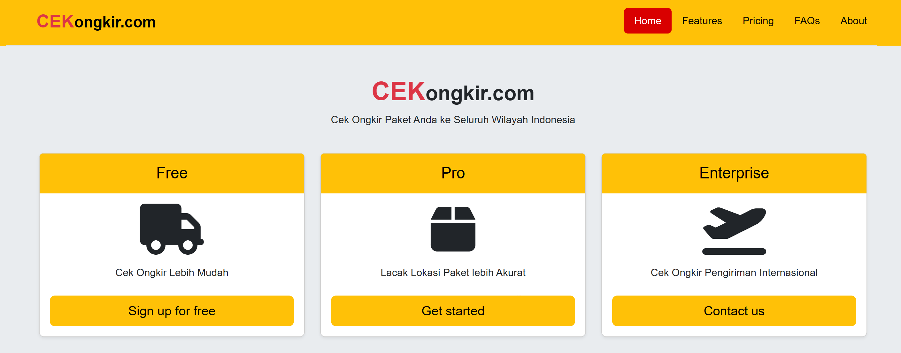

# CEKongkir

Sebuah aplikasi website sederhana untuk pengecekan ongkos kirim ke seluruh wilayah Indonesia.

## Screenshots

(./screenshot/2.png)(./screenshot/3.png)

## Installation

Clone the project

```bash
  git clone https://github.com/AgengPraba/aplikasi-cek-ongkir.git
```

Go to the project directory

```bash
  cd aplikasi-cek-ongkir
```

Generate App Key

```bash
  php artisan key:generate
```

## Setting Up the Environment Configuration

Follow these steps to create and configure the `.env` file for your Laravel project.

### 1. Copy the Example .env File

Laravel provides a default example environment configuration file. To create your own `.env` file, run:

```bash
cp .env.example .env
```

### 2. Edit the .env File

Open the .env file in your preferred text editor to configure your environment settings:

```bash
nano .env
```

or (for Visual Studio Code)

```bash
code .env
```

### 3. Configure Essential Environment Variables

Update the following key variables in the .env file:

```
DB_CONNECTION=mysql
DB_HOST=127.0.0.1
DB_PORT=3306
DB_DATABASE=your_database_name
DB_USERNAME=your_username
DB_PASSWORD=your_password

RAJAONGKIR_API_KEY=your_api_key
```

Get your [RAJAONGKIR_API_KEY](https://rajaongkir.com/akun/panel)

## Run Locally

Install dependencies

```bash
  composer install
```

```bash
  npm install
```

Create database

```bash
  php artisan migrate
```

Migrate database

```bash
  php artisan migrate:fresh --seed
```

Run npm

```bash
  npm run dev
```

run laravel (open another terminal)

```bash
 php artisan serve
```

## Tech Stack

laravel 11, bootstrap 5, jquery, select2
